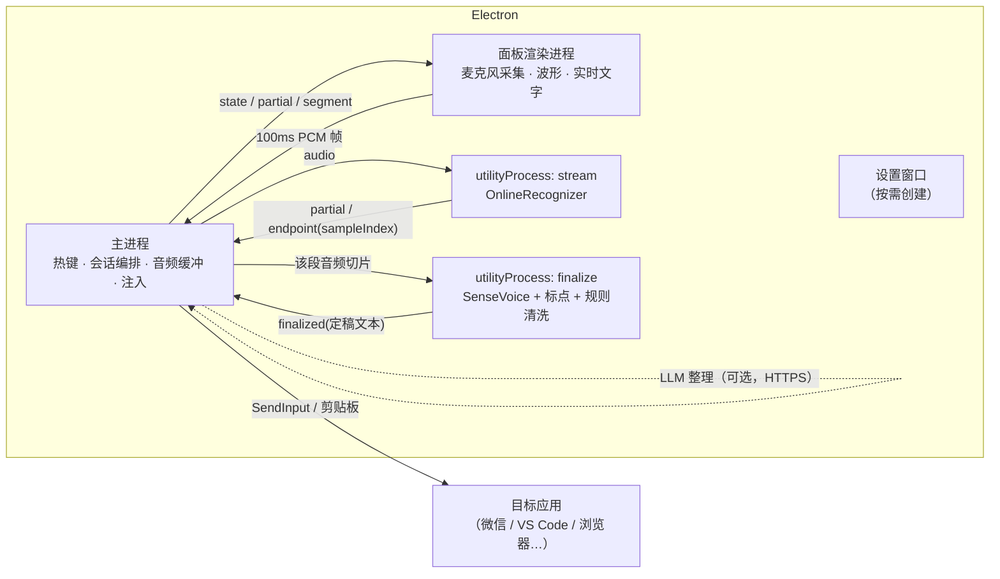
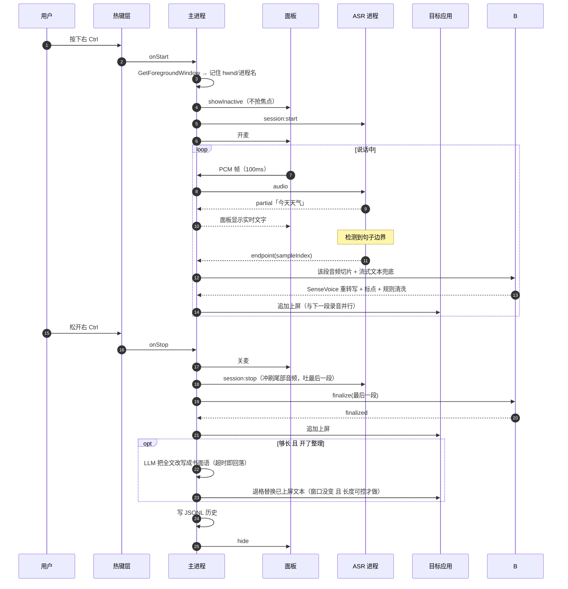

# Vocal 方案设计

> Windows 桌面语音输入。目标不是「能把语音转成字」，而是**在任何应用的任何输入框里，语音都能当成一种输入法来用**。

日期：2026-09-14 ｜ 状态：设计定稿，待实机验证

---

## 1. 目标与非目标

### 目标

| # | 目标 | 可验收的标准 |
|---|---|---|
| G1 | 任何应用都能上屏 | 微信、浏览器、VS Code、Office、终端、Electron 应用都能收到文字 |
| G2 | 延迟接近打字 | 按下热键到第一个字出现 < 600ms；松手到定稿 < 800ms（10 秒语音） |
| G3 | 不抢焦点 | 弹出面板期间，目标窗口的光标不闪、不失焦、IME 状态不变 |
| G4 | 中英混排 | "这个 bug 在 useEffect 里" 能正确出，不会变成"这个八哥在优思艾费克特里" |
| G5 | 可纠正 | 热词表能锁住人名、项目名、术语；Esc 能干净地撤回 |
| G6 | 离线可用 | 不配任何 API key，断网也能全功能运行 |
| G7 | 免安装运行时 | 用户装完就能用，不需要先装 Python / CUDA / VC++ 运行库 |

### 非目标（本期明确不做）

- **不做 TSF 输入法**。不注册 Text Service DLL，不进系统输入法列表，不画候选栏。理由见 §3.1。
- 不做实时翻译、不做会议转录、不做声纹识别。
- 不支持 macOS / Linux。代码里不为跨平台留抽象层，`win32/` 就是直接调 Win32。

---

## 2. 为什么不把 ququ 作为 submodule

调研过 [yan5xu/ququ](https://github.com/yan5xu/ququ)（Apache-2.0）。它是一个好项目，但本项目的技术选型和它交集很小：

| 层 | ququ | Vocal | 能复用吗 |
|---|---|---|---|
| ASR | Python + FunASR + torch，整段转写 | sherpa-onnx C++/ONNX，流式 | ✗ 完全不同的运行时 |
| 文本注入 | `spawn("powershell", SendKeys "^v")` | SendInput + KEYEVENTF_UNICODE | ✗ 必须重写 |
| 热键 | Electron `globalShortcut` F2 双击 | uiohook 低级钩子，支持 keyup | ✗ globalShortcut 拿不到 keyup |
| 打包 | 内嵌 Python，脚本写死 `apple-darwin` | 纯 Node 原生模块 | ✗ Windows 上跑不通 |
| UI / 交互设计 | React + shadcn 悬浮条 | 同类思路 | ○ 值得参考，但代码要重写 |
| LLM 后处理提示词 | 中文语音后处理 prompt | 同类思路 | ○ 思路可借鉴 |

**结论：加 submodule 只会带来一个永远不被构建、不被 import 的 600MB 依赖，以及一个假的「我们复用了上游」的错觉。**
真正有价值的是它的**交互设计和 prompt 思路**，那些已经写进本文档和 `DEFAULT_PROMPT` 里了。

需要时随时可以 `git clone` 它来对读，不必绑进构建图。详见 [ADR-0001](adr/0001-no-ququ-submodule.md)。

---

## 3. 架构

### 3.1 为什么是「悬浮窗 + 底层注入」而不是 TSF

真·输入法（TSF Text Service）的体验上限确实更高：composition string 带下划线、候选栏原生、和系统输入法切换无缝。但代价是：

- DLL 会被**每个**接受文本输入的进程加载。一旦崩溃或卡住，用户的记事本、Word、浏览器一起遭殃。
- 必须同时出 32 位和 64 位两份，且都要**数字签名**，否则部分受保护进程拒绝加载。
- ASR 模型不可能跑在宿主进程里，必须做 IPC 到独立服务，等于「悬浮窗方案 + 一个额外的 DLL 前端」。
- 调试极其痛苦：没法附加调试器到别人的进程。

而语音输入的交互本质上**不需要** composition —— 说话的时候没有「候选词」可选，用户要的是说完就上屏。所以 TSF 带来的主要好处（候选交互）恰好是语音输入用不上的那个。

**决策**：第一阶段做悬浮窗 + SendInput 注入。但把「文本提交」抽象成 `TextInjector` 接口，二期若要加 TSF 前端，只需实现一个新的 injector，上层逻辑不动。详见 [ADR-0002](adr/0002-text-injection.md)。

### 3.2 进程模型



**为什么 ASR 要独立进程**：sherpa-onnx 的 `decode()` 是同步 C++ 调用，一次 20~60ms。放在主进程里，托盘、热键响应、窗口移动全部会卡顿。`utilityProcess` 是 Electron 官方的 Node 子进程，能加载原生模块，用 MessagePort 通信，崩了主进程还能重启它。

**为什么拆成两个 ASR 进程**：流式解码和定稿重转写必须真正并行。用户说第 N+1 段的时候，第 N 段要能同时在另一个核上定稿，否则长输入的定稿延迟会累积成用户能感知的卡顿。详见 §4.3 和 [ADR-0005](adr/0005-long-form-pipeline.md)。

**音频只在主进程存一份**：流式进程报 endpoint 时带上「截至此刻消费了多少采样点」，主进程据此从自己的缓冲里精确切段交给定稿进程。省掉两个工作进程之间来回传音频的开销。

**为什么音频在渲染进程采集**：`getUserMedia` + `AudioWorklet` 是唯一不需要额外原生依赖的低延迟采集方式，而且浏览器会直接把采样率重采样到我们要的 16kHz。代价是每 100ms 一次 IPC —— 1600 个 float，约 6.4KB，可以忽略。

### 3.3 一次完整会话



---

## 4. 五个技术难点

### 4.1 文本注入 —— 怎么把字送进别人的窗口

Windows 上有四条路，各有死角：

| 方案 | 原理 | 优点 | 死角 |
|---|---|---|---|
| **A. SendInput + KEYEVENTF_UNICODE** | 合成键盘事件，`wScan` 直接放 UTF-16 码元 | 不动剪贴板；可以退格改写；对应用完全透明 | 长文本线性开销；少数应用过滤 `LLMHF_INJECTED`；无法穿透 UIPI |
| **B. 剪贴板 + Ctrl+V** | 写剪贴板再合成 Ctrl+V | 长文本一次到位 | 污染剪贴板；部分应用会转换格式或拦截粘贴 |
| C. `WM_CHAR` PostMessage | 直接投消息给窗口 | 不依赖焦点 | 需要精确找到目标子窗口句柄；Chrome/Electron 不吃 |
| D. UI Automation `TextPattern` | 无障碍接口写文本 | 语义正确 | 支持率极低，大部分编辑控件不实现 `TextPattern.SetValue` |

**选 A + B 混合**，由 `TextInjector` 按长度和应用黑名单自动切换（`config.injection.strategy = 'auto'`）：

- 长度 ≤ 80 字 → A（默认阈值可调）
- 长度 > 80 字，或目标进程在 `clipboardOnlyApps` 里 → B
- 流式改写（边说边上屏）→ 强制 A，因为 B 无法做「退格重写」

**失败自动降级**：选中的策略失败时自动试下一条，而不是直接报错；全都失败就至少把文本留在剪贴板，用户能自己 Ctrl+V。注入失败的原因五花八门（应用过滤合成输入、剪贴板被别的程序占用），有备胎才不会让用户说了半天一个字没出来。这一条是从 vocotype-cli 学来的，见 [ADR-0004](adr/0004-prior-art.md)。

**合成的按键都打标记**：`dwExtraInfo` 填固定魔数 `VOCAL_INJECT_TAG`，低级键盘钩子据此认出「这是我自己打的字」并放行，避免注入的字符反过来触发热键逻辑。

**已知的硬限制，要在 README 里明说**：
- 本进程以 `asInvoker` 运行，无法向**管理员权限**的窗口注入（UIPI 拦截）。这是 Windows 的设计。想支持就得整个应用提权，但提权后又会**无法注入普通进程**，两头不能兼得。
- 部分反作弊游戏会屏蔽合成输入。不在目标场景内。

**焦点保持**是这一层成立的前提。悬浮面板必须 `focusable: false` + `showInactive()`。一旦面板拿到焦点，SendInput 会打到面板自己身上 —— 这是最容易犯、也最难排查的 bug。

### 4.2 按住说话 —— globalShortcut 不够用

| 能力 | Electron `globalShortcut` | `uiohook-napi`（WH_KEYBOARD_LL） |
|---|---|---|
| keydown | ✓ | ✓ |
| **keyup** | ✗ | ✓ |
| 吞掉按键（不透传） | ✓ | ✗ |
| 组合键 | ✓ | 要自己管理修饰键状态 |

两者各缺一半，所以 `HotkeyService` 同时挂两个后端：

- `hold` / `doubleTap` 模式 → uiohook。**默认键选右 Ctrl**：单独按一个修饰键在几乎所有应用里都是空操作，所以「不能吞按键」这个缺陷正好无害。
- `toggle` 模式 → globalShortcut。组合键必须被吞掉，否则 `Ctrl+Shift+Space` 会被目标应用当成自己的快捷键。

> 如果将来必须吞掉非修饰键（比如用户坚持要用 F2 按住说话），得自己写一个 napi-rs 原生模块装 `WH_KEYBOARD_LL` 并在回调里返回 1。这是二期的事，接口已经预留（`HotkeyService` 的 backend 可替换）。

### 4.3 分段流水线 —— 长输入不能憋到最后

单一模型做不到既快又准：

- **流式模型**（chunk-based Paraformer）只看有限的右上下文，长句、中英混排、专有名词的准确率明显低于离线模型。
- **离线模型**（SenseVoice）必须等说完才能开始算。

第一版的做法是「会话结束后把整段音频重跑一次 SenseVoice」。短句没问题，**长输入是灾难**：说 3 分钟就要重转写 3 分钟，而且这期间屏幕上一个字都没有。

**改成按句子边界切段，边说边定稿：**

```
说话中 ─┬─> 流式 Paraformer ──> partial ──> 面板实时显示
        │                          │
        │                    检测到 endpoint
        │                          ↓
        └─> 主进程切出这一段音频 ──> [另一个进程] SenseVoice 重转写
                                        ↓
                                   CT-Transformer 补标点
                                        ↓
                                   规则清洗（去语气词）
                                        ↓
                                     追加上屏
```

关键在于两个工作进程**完全并行**。用户说第 N+1 段的时候，第 N 段已经在另一个核上定稿了，定稿延迟被完全藏住 —— 松手后只有最后一段需要真等。

副作用是好事：文字变成每隔几秒上一批屏，用户全程看得见进度，而不是干等一个大块头。

| 模型 | 用途 | 体积(int8) | 关键特性 |
|---|---|---|---|
| `sherpa-onnx-streaming-paraformer-bilingual-zh-en` | 实时出字、切句子边界 | ~226MB | 中英双语，自带 endpoint 检测 |
| `sherpa-onnx-sense-voice-zh-en-ja-ko-yue-int8-2024-07-17` | 逐段重转写 | ~228MB | 支持 ITN（「二零二六年」→「2026 年」），zh/en/ja/ko/粤 |
| `sherpa-onnx-punct-ct-transformer-zh-en-vocab272727-...-int8` | 补标点 | ~72MB | 对已有标点基本幂等 |
| `silero_vad.onnx` | 静音裁剪 | ~2MB | 二期用于超长录音的二级分段 |

**档位不是一个设置项，而是模型选择的结果。** 用户在设置里为「流式」和「定稿」两层各选一个模型，
或者选「不使用」；`deriveProfile()` 据此算出 `streaming+final`（默认）/ `streaming-only`（最快、内存减半）
/ `final-only`（最准，每句说完才出字）。两层都选「不使用」在界面上被挡住 —— 那样等于关掉识别。

早先这是一个独立的「引擎档位」下拉，和模型选择各说各话：用户得先理解「流式 / 定稿」两个词，
再去理解档位和模型的对应关系，而两者本来就是同一件事的两种说法。合并之后，
「点哪个模型就用哪个，没下载的点了直接开始下」是唯一的动作。

**断句阈值是可调的，而且必须可调。** sherpa 的 `rule2MinTrailingSilence` 出厂值是
1.2 秒 —— 说话中途停 1.2 秒就算这句说完了。实际用起来，"想一下措辞" 这个再正常不过的
停顿就超过 1.2 秒，于是句子被从中间切开，两半分别送去定稿，标点和上下文都对不上。
现在它是 `asr.endpointSilenceMs`（默认 1.5 秒，可调到 5 秒），`rule1` 跟着它 +1.2 秒走，
`final-only` 档位的静音切段器也用同一口径（减 300ms，因为能量判据比声学判据敏感）。
调大的代价是上屏变慢 —— 这是一个用户自己知道怎么权衡的旋钮，不该由我们替他定死。

**换模型不重启。** 模型是在构造 recognizer 时读进去的，改不了；但要换掉的只有两个
`utilityProcess`，主进程、热键、托盘、悬浮面板都不用动。`AsrEngine.reload()` 杀掉重开，
用户只等模型加载那一两秒。正在说话时请求的重载会攒到会话结束再做，不打断当前这次输入。
这是当初把 ASR 拆进独立进程换来的好处 —— 当时是为了不卡主进程，顺带买到了热重载。

**内存是这个方案最大的代价，所以有两道减法。**

第一道：用不到的进程根本不 fork。以前是「照 fork，只是不加载模型」，可空跑一个 Node 进程也要几十 MB，
而换档位现在走 `reload()` 本来就会重开进程，没必要留着占位。
`streaming-only` 省掉整个定稿进程和它的两个模型（SenseVoice + 标点，约 300MB），
`final-only` 省掉流式进程（约 230MB）。

第二道：空闲卸载（`asr.idleUnloadMin`，默认 10 分钟，0 = 常驻）。模型常驻是为了「按下热键立刻能说」，
但一个后台挂一整天的工具，为了那几次输入白占几百 MB，对大多数人换不回来。
卸载后下次按热键会多等一两秒，由面板的 `arming`（「准备中」）状态兜着 ——
`SessionController.start()` 先 `await asr.ensureReady()` 再开麦，
否则前一两秒的音频喂给一个还没初始化的进程等于白说。
用户在加载期间松手或取消也要能干净收场，不能卡在 `finalizing`。

**保护措施：**

- 音频缓冲随时长增长 → `SessionAudioBuffer.compact()` 每 60s 回收已切走的部分
- SenseVoice 在极短片段上偶尔输出空串 → 定稿长度不足流式结果一半就回落到流式文本
- 单段定稿抛异常 → 回传流式文本，会话继续，不让一段拖垮整场

**热词**走 sherpa 的 `hotwordsFile` + `hotwordsScore`。这是语音输入能不能真正替代打字的分水岭 —— 人名、项目名、缩写认不出来，用户就得回去手改，一切体验归零。热词表同时自动纳入规则清洗的保护词，避免专有名词被当成填充词删掉。

### 4.4 三层文本整理 —— 哪些要模型，哪些不要

用户说的话和能直接用的书面文字之间差三层。**只有第三层需要新东西。**

| 层 | 例子 | 靠什么 | 成本 | 离线 |
|---|---|---|---|---|
| 语气词 / 口吃 / 重复 | 「嗯那个…我我我觉得」→「我觉得」 | **纯规则** | 微秒级，0 依赖 | ✅ |
| 标点 + 数字格式化 | 「二零二六年三点五万」→「2026 年 3.5 万」 | 已有模型（CT-Transformer + SenseVoice 的 ITN） | 已在流水线里 | ✅ |
| **书面化改写 / 合并碎句 / 分段** | 「这个吧，它那个性能不行，就是慢」→「该方案性能不足，响应偏慢」 | **必须 LLM** | 云端 API 或本地小模型 | ❌ |

第三层 ASR 模型做不到 —— Paraformer 和 SenseVoice 是转写模型，你说「嗯」它就老实写「嗯」，它们没有改写能力。

**第一层：`src/shared/textCleanup.ts`**，纯函数，在定稿进程里同步跑，不需要任何模型。

档位只有 `standard` / `light` / `off`。曾经有过一个 `aggressive`，连「说实话」「其实呢」
「我觉得吧」也删 —— 砍掉了：这些词承载语气和态度，删掉之后句子的意思其实变了，
而这一层的职责只是去掉「说话时的噪音」，不是替用户重写句子。改写是第三层的活。

设计原则是**宁可漏删，不可错删**：

- 「这个方案不行」的「这个」是实词，必须保留；「这个，嗯，我觉得」的「这个」才是填充词
- 所以填充短语只在句首或被停顿标点包围时才删，孤立出现一律保留
- 叠词折叠阈值定在「出现 3 次」而不是 2 次，因为「刚刚」「看看」「谢谢」「爸爸」都合法
- 热词表自动纳入保护词

有回归测试（`npm run test:cleanup`），反例（必须原样保留的）比正例更重要。

**第三层：`LlmService.consolidate()`**，OpenAI 兼容端点，两种时机：

- `onFinish`（默认）：会话结束后整理一次，退格替换已上屏文本
- `rolling`：每积累 300 字整理一次，只替换那一块

退格替换是危险动作，三道闸：

1. 目标窗口必须还是当初那个（`hwnd` 一致），否则拒绝退格 —— 不然删的是别人的字
2. 退格数超过 `maxReplaceChars`（默认 1500）就拒绝，只把结果留在历史里
3. LLM 输出长度偏离输入 0.4~2.5 倍之外就认定跑题，直接丢弃

第三道闸是必须的：模型偶尔会「回答」而不是「整理」—— 你口述「帮我看看这段代码」，它真的开始给你讲代码。

**任何一层失败都不影响主链路**：LLM 超时、报错、没配 key，一律返回上一层的结果，用户只是少一层整理。

本地小模型（Qwen3-1.7B 级别 + llama.cpp）能替掉第三层的云端依赖，代价是 +2GB 体积、慢 3~5 倍，二期再说 —— 换掉 `LlmService` 的实现即可，上层不动。

### 4.5 打包分发

- **零编译依赖**（真的零）：`koffi`（`@koromix/koffi-win32-x64`）、`uiohook-napi`（包内 `prebuilds/win32-x64`）、`sherpa-onnx-node`（`sherpa-onnx-win-x64`）全是预编译。`npm install` 不执行任何 node-gyp，不需要 Python、不需要 Visual Studio。历史记录用 JSONL 而不是 SQLite 就是为了保住这一点，见 [ADR-0006](adr/0006-no-native-build.md)。
- **模型不进安装包**。四个模型加起来 500MB+，打进去会让安装包无法增量更新，也让「只想试试」的用户望而却步。首次启动检测缺失 → 直接把设置窗口开到「识别」页，用户点一下就开始下载，不弹对话框、不用跑命令行。
- **两个产物，两套数据位置**。zip（便携版）把 `data/` 放在 exe 旁边，整个文件夹拷走就能换机器；NSIS（安装版）用 `%APPDATA%\Vocal`。
  后者不是退让 —— NSIS 升级本质是「卸载再安装」，会重写整个安装目录，数据放那儿每次自动更新都会连锅端掉用户的模型和历史。
  两者靠**卸载程序**区分：NSIS 一定在安装目录留一个 `Uninstall Vocal.exe`，zip 里绝不会有。不需要标记文件，也不需要用户做任何事。
- **自动更新只对安装版开**（`electron-updater` + GitHub Releases）。便携版的位置是用户自己定的、数据就在 exe 旁边，让安装器往那儿覆盖是拿用户数据冒险 —— 它只提示有新版，不自己动手。
  安装版后台静默下载，下完**不弹框**，等下次退出应用时装上：语音输入随时可能被热键叫起来，弹「立即重启」把人从正在写的东西里拽出来是最糟的做法。想现在装的人有个按钮。
- **不发 RAR**。私有格式，Windows 不能双击打开，用户得先装 WinRAR —— 在一个「装完就能用」的项目上加这道门槛没有道理。
- **NSIS 装到 `%LOCALAPPDATA%\Programs`**（`perMachine: false`），不要管理员权限。提权会让 SendInput 反过来无法注入普通进程，见 §4.1。
- **`asarUnpack`** 必须包含所有含 `.node` 的目录（含 `@koromix/**` —— koffi 的平台二进制在这个 scope 下），否则原生模块在 asar 里加载不了。
- **lockfile 必须在干净状态下生成**：增量 `npm install` 会把非本平台的 optional 依赖从 lock 里剔掉，Windows 上就装不到 `sherpa-onnx-win-x64`。改依赖后要 `rm -rf node_modules package-lock.json` 重新解析。
- **`requestedExecutionLevel: asInvoker`**。见 §4.1，提权是反效果。

---

## 5. 延迟预算

「能和打字比」意味着延迟必须落在人不觉得在等的区间。

下表的「实测」来自 `npm run m1:asr`，跑在 Windows 11 / x64 / 纯 CPU（无 GPU 加速）、
Electron 44.3.0 + onnxruntime 1.28.2、`numThreads: 2`。

**说话过程中**（每段说完 → 那段文字出现在目标窗口）：

| 环节 | 预算 | 实测 | 说明 |
|---|---|---|---|
| endpoint 检测 | 0 | 0 | 流式模型自带，不额外花时间 |
| 主进程切片 + IPC | < 5ms | — | 音频只在主进程存一份 |
| SenseVoice 重转写（5s 片段） | 80~250ms | **107ms** | 2 线程 CPU，int8 |
| 补标点 | 20~50ms | **3ms** | 远好于预期 |
| 规则清洗 | < 1ms | — | 纯字符串操作 |
| SendInput 追加 20 字 | ~10ms | — | 一批 200 条 INPUT 一次投递 |
| **合计** | ~120~320ms | **~120ms** | **且与下一段录音并行，用户基本无感** |

**松开热键 → 全部完成**：

| 环节 | 预算 | 说明 |
|---|---|---|
| 尾部音频冲刷 | ~80ms | 补 0.5s 静音把尾字挤出来 |
| 最后一段定稿 | ~120ms | 实测值 |
| LLM 整理（若开启，600 字） | 800~2500ms | 默认只在 ≥120 字时触发；超时硬回落 |
| 退格替换 | 长度 × ~0.3ms | 1500 字上限 ≈ 450ms |
| **合计（不含 LLM）** | **~200ms** | |

**启动预热**（应用启动时一次性付出，用户按第一次热键之前就做完）：

| 模型 | 实测加载 |
|---|---|
| 流式 Paraformer（int8） | 931ms |
| SenseVoice（int8） | 909ms |
| CT-Transformer 标点（int8） | 180ms |

两个工作进程并行加载，所以墙钟约 1 秒。

**磁盘占用**：四个模型解压并剔掉 fp32 副本后共 **531 MB**（`scripts/models.json` 的 `prune`
负责在解压后删掉 `encoder.onnx` / `decoder.onnx` / `test_wavs`，不然是 1.5GB）。

> 结论：定稿延迟比设计时的估算还好，落在预算下限。**DirectML GPU 加速的优先级可以调低** ——
> 107ms 已经完全能藏在下一段录音里，GPU 省下的几十毫秒用户感知不到。

## 6. 和普通输入法的对比

这是项目的立项依据，也是验收基准。

| 维度 | 拼音输入法 | Vocal（本方案） | 差距与对策 |
|---|---|---|---|
| 输入速度 | 60~90 字/分（熟练） | 150~250 字/分（口述） | ✅ 语音天然快 2~3 倍 |
| 首字延迟 | < 50ms | ~600ms | ⚠️ 结构性劣势。对策：流式先上屏，让用户感知不到等待 |
| 准确率（常用语） | ~99%（有选词） | 95~98% | ⚠️ 对策：SenseVoice 重转写 + 热词表 |
| 专有名词 | 用户词库，长期积累 | 热词表（`hotwordsFile`） | ⚠️ 对策：从历史记录里自动挖掘候选热词（二期） |
| 纠错成本 | 打字时即时选词 | 事后手改 | ❌ 本质劣势。对策：Esc 整段撤回；二期做「说『改成 XX』」的语音纠错 |
| 标点 | 手动输入 | 自动恢复 | ✅ 优势 |
| 口语痕迹 | 不存在（打字不会说「嗯」） | 规则层自动删 | ⚠️ 打平 |
| 长文成稿 | 边打边改，边想边组织 | 说完一次性整理成书面语 | ✅ 优势（前提是接了 LLM） |
| 中英混排 | 需切换中英状态 | 模型自动判定 | ✅ 优势 |
| 数字 / 单位格式化 | 手动 | ITN 自动（「三点五万」→「3.5 万」） | ✅ 优势 |
| 安静环境要求 | 无 | 需要 | ❌ 本质劣势，无解 |
| 隐私 | 部分云同步 | 全本地（LLM 可关） | ✅ 优势 |
| 资源占用 | ~50MB 内存 | ~800MB 内存（模型常驻） | ⚠️ 对策：可配置只加载流式模型 |
| 任意应用可用 | ✅ 系统级 | ✅ 但无法注入提权窗口 | ⚠️ 已知限制 |

**一句话结论**：Vocal 在「长文本一次性输出」上稳赢打字（写邮件、写文档、写 commit message、聊天）；在「短促、需要精确、需要边想边改」的场景（写代码、填表单、改别人的句子）输给打字。产品定位应该明确站在前者。

---

## 7. 风险与未验证项

标 🔴 的必须在 Windows 实机上先验证，验证不过就要换方案：

| # | 风险 | 影响 | 验证方式 |
|---|---|---|---|
| ✅ R1 | ~~koffi 的 `INPUT` 联合体在 x64 上的对齐~~ | — | **已验证**：`sizeof(INPUT) = 40`，SendInput 48/48 条被接受（`npm run m0:inject`） |
| ✅ R2 | ~~`sherpa-onnx-node` 在 Electron 里能否直接加载~~ | — | **已验证**：Electron 44.3.0 / Node 24.20.0 下 v1.13.8 + onnxruntime 1.28.2 正常（`npm run m0:native`） |
| 🟡 R3 | `focusable: false` 的面板会不会在某些应用上仍然夺焦 | 文字打到面板自己身上 | **基本通过**：`npm run m0:focus` 自动比对句柄未变；仍需逐个测微信 / Office |
| 🟡 R4 | `GetGUIThreadInfo` 在 Chrome / Electron / 终端里拿不到 caret | 面板位置退化到屏幕底部 | 已有回落逻辑，验证回落是否体面 |
| 🟡 R5 | uiohook 低级钩子被安全软件拦截 | 热键失灵 | 装 360 / 火绒环境下测（这台机器上有火绒）。模块本身加载正常，键名白名单见 `src/shared/hotkeys.ts` |
| ✅ R6 | ~~`better-sqlite3` 的 electron-rebuild 在用户机器上失败~~ | — | **已消除**：换成 JSONL，项目零编译依赖，见 [ADR-0006](adr/0006-no-native-build.md) |
| 🟠 R7 | **SenseVoice 对静音会幻觉出内容** | 用户没说话，屏幕上凭空多字 | **M1 实测暴露**：5 秒纯静音 → 输出「我.」。已加两道防线，见下 |
| 🟡 R8 | 长输入时退格替换把用户自己敲的字删掉 | 数据损坏，最难原谅的 bug | 已有三道闸（hwnd 一致 / 长度上限 / LLM 输出健全性），需专门测「说到一半自己改一个字再继续」 |
| 🟢 R9 | 段与段之间的拼接不自然（缺空格、标点重复） | 文本质量 | 规则层的 `tidy()` 已处理，跑 `npm run test:cleanup` |

**R7 的两道防线**（`src/shared/audioGate.ts`，有 10 个回归测试）：

1. **语音门限**：交给 SenseVoice 之前先按 20ms 帧算 RMS，活跃帧占比低于 4% 直接丢弃这一段。
   按帧算而不是整段算，是因为「10 秒里说了 1 秒」整段 RMS 会被稀释到阈值以下（误杀），
   而「静音里一声咳嗽」整段 RMS 又会被拉高（误放）。
2. **定稿健全性**：流式模型全程没憋出一个字、离线模型却冒出一两个字 —— 两者听的是同一段音频，
   这只可能是幻觉，丢掉。够长才采信（说明确实有内容，只是流式没跟上）。

阈值取向是**宁可放过也不误杀**：漏掉一个静音段只是多花 100ms，误杀一句话是丢字。

**R1 已从 🔴 降到 🟠**：[233stone/vocotype-cli](https://github.com/233stone/vocotype-cli) 在生产环境用同一套
`SendInput` + `KEYEVENTF_UNICODE` + 剪贴板兜底跑通了，结构体定义和我们独立得出的一致。
剩下的不确定性只在 koffi 这个 FFI 绑定本身，不在方案。见 [ADR-0004](adr/0004-prior-art.md)。

## 8. 目录结构

```
vocal/
├─ docs/
│  ├─ DESIGN.md              本文档
│  ├─ ROADMAP.md             分阶段计划
│  └─ adr/                   架构决策记录（0001~0005）
├─ scripts/
│  ├─ models.json            模型清单（下载脚本与主进程共用）
│  └─ fetch-models.mjs       下载 + 解压 + 校验
├─ src/
│  ├─ shared/                三个进程共享
│  │  ├─ types.ts            领域模型 + 两个工作进程的协议
│  │  ├─ ipc.ts              IPC 通道名 + AppConfig + 桥接口
│  │  ├─ config.ts           zod schema + 默认值 + 两套提示词
│  │  ├─ textCleanup.ts      ★ 规则层口语清洗（纯函数，无依赖）
│  │  └─ textCleanup.test.ts   回归测试
│  ├─ main/
│  │  ├─ index.ts            装配与生命周期
│  │  ├─ win32/user32.ts     ★ koffi FFI：SendInput / caret / 前台窗口
│  │  ├─ services/
│  │  │  ├─ session.ts       ★ 会话编排器（整个应用的心脏）
│  │  │  ├─ asr/
│  │  │  │  ├─ engine.ts     ★ 管两个工作进程，按 endpoint 切段
│  │  │  │  ├─ audioBuffer.ts  会话音频缓冲（chunk 链表 + 定期回收）
│  │  │  │  └─ models.ts     模型路径与完整性检查
│  │  │  ├─ injector/
│  │  │  │  ├─ index.ts      ★ 注入策略链 + 失败降级
│  │  │  │  └─ targetBuffer.ts ★ 目标窗口文本镜像，最小改动推进
│  │  │  ├─ hotkey/          双后端热键
│  │  │  ├─ llm/             书面化整理（可失败）
│  │  │  ├─ history/         JSONL 存储 + 单元测试
│  │  │  └─ config/          持久化
│  │  └─ windows/            悬浮面板 / 设置窗口
│  ├─ preload/index.ts       contextBridge
│  ├─ asr-worker/
│  │  ├─ stream.ts           ★ 流式进程：实时文本 + 句子边界
│  │  └─ finalize.ts         ★ 定稿进程：重转写 + 标点 + 清洗
│  ├─ types/                 第三方库的类型补丁
│  └─ renderer/
│     ├─ public/pcm-worklet.js  AudioWorklet
│     ├─ shared/capture.ts      麦克风采集
│     ├─ panel/                 悬浮条 UI
│     └─ settings/              设置（按流水线分页：触发/识别/清洗/整理/上屏）
├─ electron.vite.config.ts
├─ electron-builder.yml
└─ package.json
```

★ = 核心逻辑所在，其余是脚手架。

## 9. 路线图

见 [ROADMAP.md](ROADMAP.md)。一句话：先用最小闭环验证 R1/R2/R3 三个红色风险，再谈功能。
